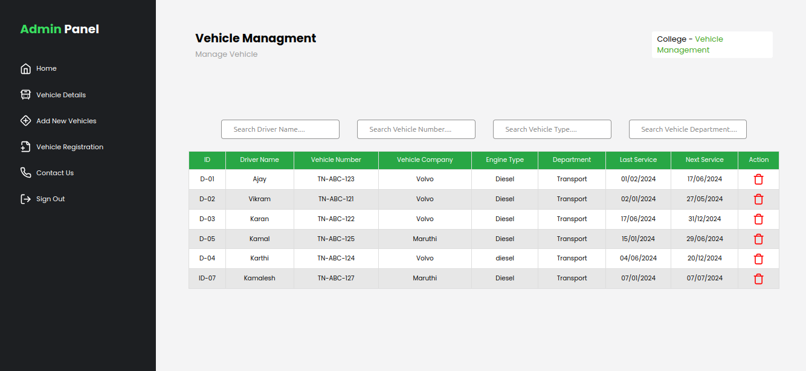

# KEC VEHICLE MANAGEMENT SYSTEM 🚌

This application was developed in two days during the intra-college event `E-Horyzon'24`, where we won a `prize 🏅` 

## Preview



## Technologies Used
- [**Vite**](https://vitejs.dev/) + [**React**](https://reactjs.org/): Fast and lightweight development environment and framework for building modern web applications.
- [**MERN Stack**](https://www.mongodb.com/mern-stack):
  - [**MongoDB**](https://www.mongodb.com/): A NoSQL database for storing data.
  - [**Express**](https://expressjs.com/): A minimal and flexible Node.js web application framework.
  - [**Node.js**](https://nodejs.org/): A JavaScript runtime built on Chrome's V8 JavaScript engine for server-side programming.
- [**Twilio**](https://www.twilio.com/en-us): Deliver notifications across text, email, voice.

## Table of Contents

- [Prerequisites](#prerequisites)
- [Installation](#installation)
- [Configuration](#configuration)
- [Usage](#usage)
- [Deployment](#deployment)
- [Contributing](#contributing)
- [License](#license)

## Prerequisites

Before you begin, ensure you have the following prerequisites:

- Node.js and npm installed.
- MongoDB Atlas account for database storage.
- Twilio account for sending messages.

## Installation

1. **Clone the repository**
```bash   
git clone https://github.com/kamalj57/KEC-VMS.git
```
2. **Install the necessary dependencies**
```bash
npm install
```

## Configuration
1. **Frontend Configuration**

- Create a `.env file` in the client directory
```env
VITE_REACT_APP_API= WebserviceURL  # Update with your server
```
2. **Server Configuration**
   
- Create a `.env file` in the server directory.
```env
PORT=8080
MONGODB_URI=your_mongodb_uri    # Update with your MongoDB Atlas connection URI
ACCOUNT_ID=your_twilio_account_id  # Update with your twilio account id
AUTH_TOKEN=your_twilio_auth_token  # Update with your twilio auth token
TWILIO_NUMBER=your_twilio_number  # Update with your my twilio phone number
```
## Usage
1. **Start the server**
```bash
 cd server
```
```bash
npm start
```

2. **Start the frontend**
```bash
cd client
```
```bash
npm run dev
```
Visit http://localhost:5173 in your browser to access the application.

## Deployment
Follow your preferred deployment method to deploy the application. Ensure to set the environment variables for production in your deployment environment.

## Contributing
Contributions are welcome! Feel free to open issues and pull requests.

## License
This project is licensed under the MIT License.
Make sure to replace placeholder values (like `your_mongodb_uri`, `your_twilio_account_id`, `your_twilio_auth_token`, `your_twilio_number`) with your actual credentials.

